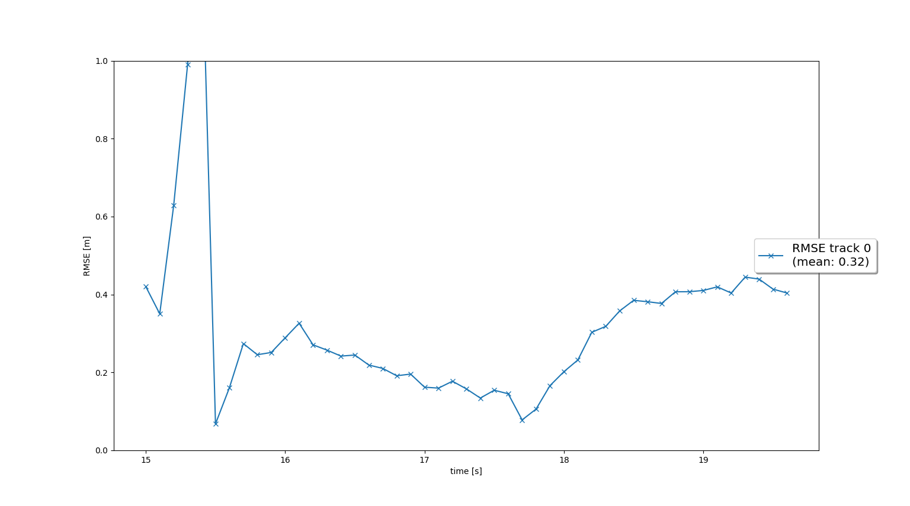
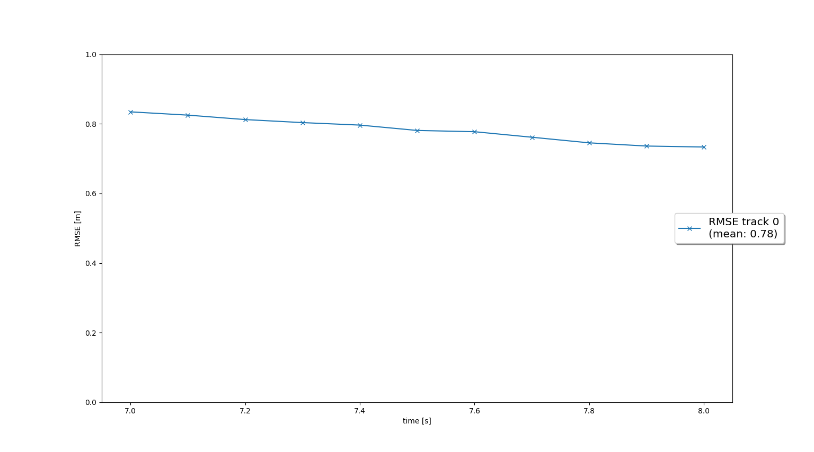

 # Writeup: Track 3D-Objects Over Time

Please use this starter template to answer the following questions:

## Writeup

### 1. Write a short recap of the four tracking steps and what you implemented there (filter, track management, association, camera fusion). Which results did you achieve? Which part of the project was most difficult for you to complete, and why?

Step 1. Tracking with Extended Kalman Filter (EKF): I implemented a non-linear Kalman filter with 6 dimensions. The states were the position (x, y, z) and the velocity (vx, vy, vz). The filter is able to combine noisy measurements from multiple sensors (camera, lidar) and fuse them with a model of the system (vehicle motion). This allows the filter to:
- Predict the vehicle's future state based on its dynamics
- Correct the prediction using incoming sensor data
- Maintain a robust estimate of position and velocity over time, even in the presence of noise and uncertainty

The model used was a constant velocity model:
```
F = [1., 0., 0., self.dt, 0., 0.],
    [0., 1., 0., 0., self.dt, 0.],
    [0., 0., 1., 0., 0., self.dt],
    [0., 0., 0., 1., 0., 0.],
    [0., 0., 0., 0., 1., 0.],
    [0., 0., 0., 0., 0., 1.]]
```

Step 2. Track Management: Track management refers to the process of maintaining a set of target tracks over time in a dynamic environment. Each track represents a hypothesized object (in this case, vehicle) being monitored. I implemented a module responsible for track management (new tracks creation, deletion of old tracks based on sensor measurements). This included calculation of track score to confirm likely tracks and reject of implausible tracks / false positives. A moving window of 6 frames was used, each time a measurement is associated with a track, the track score is increased of +1/window. If in a frame the object is not present the score is decreased. The score is held constant of the predicted position is outside the sensor's fov, in this case the track is delected after some time by checking the state covariance matrix P.

Step 3. Data Association: In the data association module, all new measurements are assigned to a track. The data association algorithm decides whether a given measurement was generated from an existing track (and in case it updates the corresponding track), or whether it represents a newly-detected track (e.g., a car that has just entered the fov). Using an association matrix, the algorithm assigns a track the closest measurement using the Mahalanobis distance, which accounts for uncertainty in both the prediction and the measurement. The algorithm works assuming that each track generates at most one measurement, and each measurement originates from at most one track.

Step 4. Sensor Fusion: Allows to fuse measurements coming from different sensors, namely camera and lidar. A transformation is needed to translate from vehicle coordinates to sensor coordinates to compute the prediction error. For lidar this is a simple identity matrix as lidar measurements are already in the vehicle coordinate system, while for the camera the measurement model h(x) is non linear. A method that checks whether an object can be seen by the sensor or is outside the field of view was also implemented.

The project was well guided and was not hard complicated to complete in itself. What I'm confused about is how the filter takes into account the ego vehicle motion. The vehicle and so the sensors are not stationary, so the change in position and speed of the object is a combination of the ego motion with the object motion. While a constant velocity model "works", I'd like some more details on if and how to take into account the ego motion.

### 2. Do you see any benefits in camera-lidar fusion compared to lidar-only tracking (in theory and in your concrete results)? 

Lidar excels at providing accurate 3D spatial information, distance and velocity. Cameras, on the other hand, capture high-resolution RGB data, enabling fine-grained object detection and classification. Combining depth from lidar with visual cues from cameras allows for more robust perception, especially in ambiguous or cluttered environments. Fusion also increases resilience to sensor failure or environmental limitations. In our experiments, tracking performance improved when both sensors were used. The fused system achieved lower RMSE scores compared to lidar-only setup, indicating more accurate and stable object tracking.

### 3. Which challenges will a sensor fusion system face in real-life scenarios? Did you see any of these challenges in the project?

Using multiple sensors adds to the processing time of the incoming data, also, they need to be synchronized for accurate calculations. Also, many times, objects are detected by only one sensor, and not by others (due to e.g different sensor fovs). Therefore, it takes a few frames for these unconfirmed objects to be detected. Also different sensors behave differently under adverse conditions, though this was not an issue for the project as dataset was taken on a clear sunny day. Nighttime tracking may rely more heavily on lidar, while daytime scenes benefit from rich camera data.

### 4. Can you think of ways to improve your tracking results in the future?

As mentioned in the suggestions: implementing a more advanced data association, e.g. Global Nearest Neighbor (GNN) or Joint Probabilistic Data Association (JPDA) would help to handle with non ideal situations, like cluttering. There might be also the possibility for low-level fusing of RBG and lidar data and use deep learning directly on the fused measurements.

## Results

### 1. Track objects over time with a Kalman Filter

EKF is applied to a simple single-target scenario with lidar only, the chieved RMSE score is 0.32.


### 2. Initialize, update and delete tracks

The visualization shows that a new track is initialized automatically where unassigned measurements occur, the true track is confirmed quickly, and the track is deleted after it has vanished from the visible range


<video src="img/tracking_results_single.mp4" />
